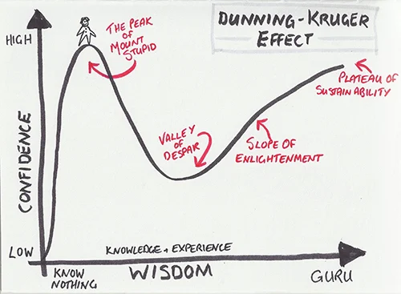

# conlanger

An experiment in automatic Conlang creation. 

I am a novice Conlanger, currently enjoying the view from the peak of Mount Stupid, so this may go nowhere useful. I'm mostly hoping it goes somewhere dumb and ridiculous.

## Data Preperation

Language [phoneme data](https://raw.githubusercontent.com/phoible/dev/v2.0/data/phoible.csv) from [phoible.org](https://phoible.org/) was used to create a dataset suitable for ML. One dialect phoneme inventory from each language was selected and prepared as a 4d Numpy array.

Data preperation notebook: [prepare_phoible_data.ipynb](./notebooks/prepare_phoible_data.ipynb)

Language phonemes npy file: [language_phonemes.npz](./notebooks/data/language_phonemes.npz)

## Language prediction

Before using a [GAN](https://en.wikipedia.org/wiki/Generative_adversarial_network) (generative adversarial network) to generate new language phoneme inventories, I wanted to check that it was possible to predict languages by their phonemes.

Language prediction notebook: [predict_languages.ipynb](./notebooks/predict_languages.ipynb)

Overall the accuracy is very poor, but the number of classes is very high relative to the number of training samples (approx 80%). The model tends to just pick languages with the most samples in the training data. However, it does perform better than random chance and better than just picking one of the 5 most common languages in the training set.

## Language phoneme inventory generation

Here's where the fun begins. I've previously [experimented building GANs](https://github.com/Pappa/MiroBot) to generate fake images (Joan Miro and Mark Rothko paintings), with varying degrees of success. It's relatively easy to do using Conv2D transpose layers in Keras, though requires a lot of trial and error to avoid overfitting (or sometimes just to produce anything at all). I figured that if I could represent the features of a language in a 3D vector, I could use the same GAN architecture to generate fake language phoneme inventories. I've barely bothered tuning the GAN architecture. It needed a few tweaks to prevent it overfitting and  memorising samples. I removed some layers from the generator, reduced the number of epochs and increased the learning rate. Essentially, I just needed to make it a bit worse at generating fakes. This makes a lot of sense considering the difference in complexity between these simple pixilated phoneme inventory images and the far more complex Miro and Rothko paintings.

Phoneme inventory generation notebook: [phoneme_gan.ipynb](./notebooks/phoneme_gan.ipynb)

## Next steps

- Determine phonotactics (probably just default to _(C)V_ to begin with)
- Generate root words using the phoneme inventory
- Determine basic grammar
- Create proto-language lexocon
- Apply (random?) selection of sound change rules
   - Update phonology, phonotactics, grammar and lexicon after each iteration
   - Is it possible to determine and update language morphology here?
- Create HTML/PDF language grammar document
- Create sample audio wav files