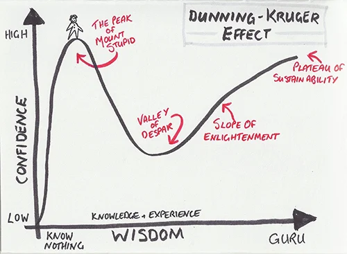
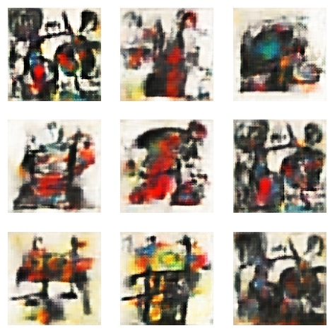
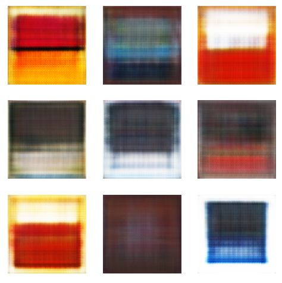
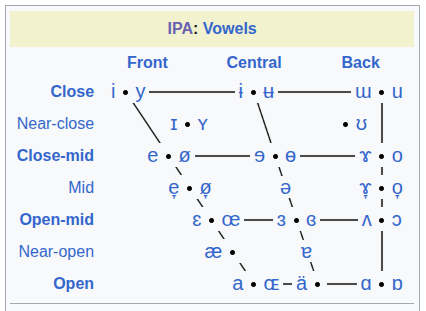
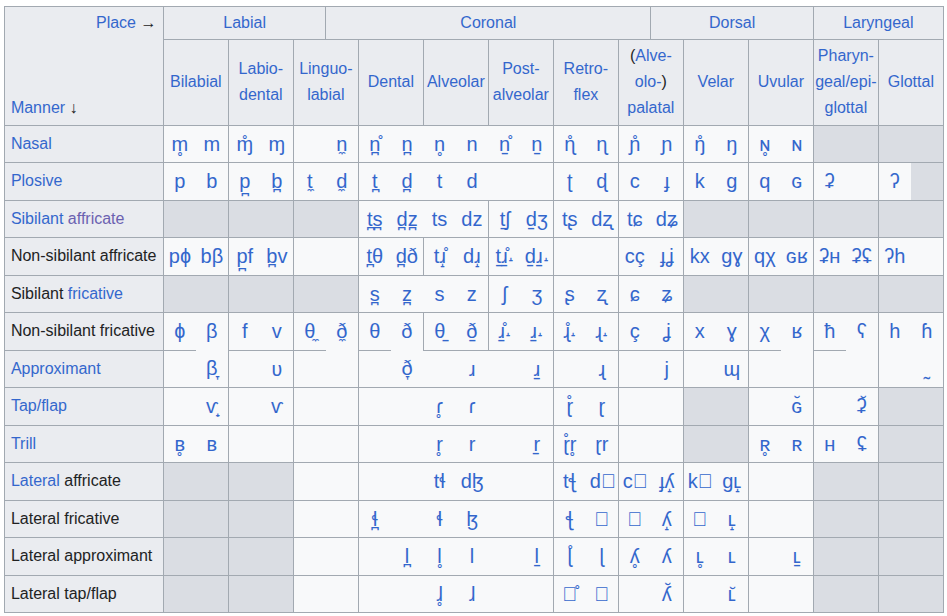
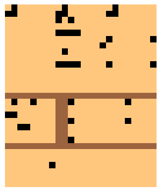
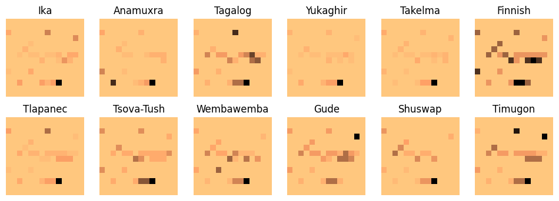
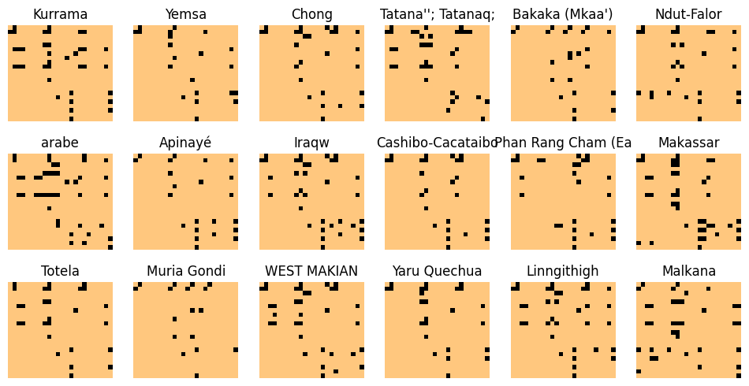

# conlanger

An experiment in automatic [conlang](https://en.wikipedia.org/wiki/Constructed_language) creation. 

I am a novice conlanger, currently enjoying the view from the peak of Mount Stupid, so this may go nowhere useful. I'm mostly hoping it goes somewhere dumb and ridiculous.

## Why automatic conlang creation?

A few years ago, I experimented building a [GAN](https://en.wikipedia.org/wiki/Generative_adversarial_network) (generative adversarial network) to generate fake Joan Miró paintings. The result, [MiroBot](https://github.com/Pappa/MiroBot), wasn't very good at creating a convincing Miró, but it did pretty well when I fed it Mark Rothko paintings instead.

| Fake Mirós | Fake Rothkos |
|------|---------------|
|  |  |

Given a 2d image of random noise as input, the trained model spits out a Rothko.

In principle GANs are quite a simple idea. Two models compete against each other. 

- A `discriminator` (or critic) is trained to predict if something is legit (like a real Mark Rothko painting).
- A `generator` takes random noise as input and applies transformations to the data, using feedback from the GAN as guidance.
- The GAN uses the prediction from the discriminator as a score to train the generator.
- During training, the generator iteratively improves until eventually it can trick the discriminator most of the time.

In practice, GANs are often very unstable and can be tricky to tune.

### Sorry, but what's this got to do with conlanging?

I started reading about conlanging and a couple of things stood out.

1. The full inventory of IPA phonemes can be represented using a few tables (_which are 2d matrices, right?_).

| IPA Vowels | IPA Plumonic Consonants |
|------|---------------|
|  |  |

2. There's a ton of [cldf](https://cldf.clld.org/) data available on the properties and characteristics of the world's languages, and it can all be presented in tabular form. 

So, I can represent the phoneme inventory of any language as a very simple 2d image:

And represent other characteristics of any language as 2d images.

**WALS data**

**Phoible data**

The upshot of all this is that I realised I can use this data to train a GAN (or use some other method like SMOTE) to generate random, 
but plausible skeleton languages, including a phoneme inventory and other characteristics of the language.

  

### Language Evolution

It's all well and good generating a fake but plausible language based on the properties of existing languages, but a good 
conlang should have a history. It should evolve from a proto-language.

In the distant past of the internet, some mad bastard compiled the [Index Diachronica](https://web.archive.org/web/20260722074750/https://chridd.nfshost.com/diachronica/all), a set of sound change rules for ~6000 languages, gathered from the published literature. The rules 
encode how the sounds in a language change over time (typically as an ancestor language evolves into a descendent).

Sound change rules have widely used syntax conventions, like:

`a → e / _j ! l_` - a changes to e when it preceeds j, but not if it follws l.

I discovered that there are some sound change appliers, like [ASCA](https://github.com/Girv98/asca-rust) and [Brassica](https://github.com/bradrn/brassica) to apply sound changes programmatically, so I thought, _"cool I'll just parse the Index Diachronica html file and convert it to a format that can be read by ASCA or Brassica"_. The end goal would be to create a set of random but plausible sound change rules to apply to the newly generated language, to mimic the evolution of real languages from their proto-languages.

Unfortunately, linguists aren't particularly consistent in their use of sound change rule conventions and often fall back to text descriptions to handle edge cases. As a result, Index Diachronica has a lot of rules like:

- `C[+labial/+velar] → ʷ / adjacent to short u`
- `j → s (possibly only initially?)`
- `t → {t,r,kʷ} / #_ (I’m not kidding. That’s what’s listed as the reflexes.)`
- `q (→ kw ?) → v (rare)`
- `e → ə / _N, when unstressed (?)`

So, I've spent the past 2 years (on and off) trying to parse Index Diachronica programatically.

My first attempt got me to about a 60% success rate (meaning 60% of rules being run using ASCA without throwing an error).

After a hiatus of a few months, I decided to let AI take a stab at it. I vibe-coded a solution with Cursor. The result was about 60% success, and the resulting code was unreadable with lots of incorrect transformations. I ditched the AI version and took another break.

I've taken a more systematic approach, using AI to help me research the domain, define the requirements and implement and test the system incrementally. 

This has been far more successful so far, with > 80% of rules validated. There are definitely bugs and incorrect bits and pieces in the current implementation, but it's probably getting close to _"good enough"_ for what I need.

## The end goal for this project

I want to press a button and watch a fully developed conlang appear before my eyes, complete with a written grammar, translations and sample audio of the language being spoken.

The implementation will consist of 2 parts:

### 1. Model Training

- Ingest data
  - IPA data
  - CLDF data (Phoible, WALS, etc.)
  - Parsable Index Diachronica sound change rules
- Train GANs

### 2. Generate a conlang on demand

- Create the proto-language
  - Generate a phoneme inventory
  - Determine phonotactics
  - Generate root words
  - Determine basic grammar characteristics
  - Create proto-language lexicon
- Evolve the language
  - Generate plausible sound-change sequences
  - Apply generated sound change rules to the proto-language
  - Evolve/update the grammar
- Publish conlang artefacts
  - Generate sample translations
  - Generate HTML/PDF language grammar document
  - Generate sample audio files

## Implemented so far

Most of the early work was done in Jupyter notebooks. This will be ported over to a repeatable data processing pipeline once I'm finished with the Index Diachronica work.

### Data Preperation

Language [phoneme data](https://raw.githubusercontent.com/phoible/dev/v2.0/data/phoible.csv) from [phoible.org](https://phoible.org/) was used to create a dataset suitable for ML. One dialect phoneme inventory from each language was selected and prepared as a 4d Numpy array.

Data on morphology and grammar from [WALS](https://wals.info/) was prepared in a similar way.

- Phoible data preperation notebook: [01_01_prepare_phoible_data.ipynb](../notebooks/01_01_prepare_phoible_data.ipynb)
- WALS data preperation notebook: [01_02_prepare_wals_data.ipynb](../notebooks/01_02_prepare_wals_data.ipynb)
- Language phoneme data npz file: [language_phonemes.npz](../notebooks/data/language_phonemes.npz)
- WALS data npz file: [language_parameters.npz](../notebooks/data/language_parameters.npz)

### Language prediction

Before using a [GAN](https://en.wikipedia.org/wiki/Generative_adversarial_network) (generative adversarial network) to generate new language phoneme inventories, I wanted to check that it was possible to predict languages by their phonemes.

- Language prediction notebook: [01_03_predict_languages.ipynb](../notebooks/01_03_predict_languages.ipynb)

Overall the accuracy is very poor, but the number of classes is very high relative to the number of training samples (approx 80%). The model tends to just pick languages with the most samples in the training data. However, it does perform better than random chance and better than just picking one of the 5 most common languages in the training set.

### Language phoneme inventory generation

For phoneme inventory generation, I barely bothered tuning the GAN architecture that I used for Rothko paintings. It needed a few tweaks to prevent it overfitting and memorising samples. I removed some layers from the generator, reduced the number of epochs and increased the learning rate. Essentially, I just needed to make it a bit worse at generating fakes. This makes a lot of sense considering the difference in complexity between these simple pixilated phoneme inventory images and the far more complex Miro and Rothko paintings.

- Phoneme inventory generation notebook: [02_01_phoneme_gan.ipynb](../notebooks/02_01_phoneme_gan.ipynb)

### Morphology and grammar rule generation

Morphology and grammar rules were generated in a similar way, though it took a lot more experimentation to produce realistic rulesets. 
This is probably because of the way the each value is represented in the data, as an ordinal number rather than binary. The results aren't 
ideal as some important values can be missing from the generated data. I might need to try a different approach.

- Morphology and grammar rule generation notebook: [02_02_wals_parameters_gan.ipynb](../notebooks/02_02_wals_parameters_gan.ipynb)

### Lexicon generation

Data from the Universal Language Dictionary (obtained from [web.archive.org](https://web.archive.org/web/20120505130853/http://ogden.basic-english.org/belist1.html)) was used to create a basic wordlist for translation. I got a few thousand sets of phonotactic rules
from ChatGPT and used their relative frequency to rate each by "weirdness". I've written a _very naive_ lexicon generation tool that accepts
a basic syllable structure and phoneme inventory, and generates a lexicon. The idea is that the phoneme inventory can be generated by the 
GAN and supplied to the lexicon builder. The lexicon builder produces a lot of unrealistic words, but my plan is to apply a series of sound 
change rules to the lexicon. I'm hoping this will result in a set of proto-language root words that seem naturalistic.

- Word list creation notebook: [03_01_word_list.ipynb](../notebooks/03_01_word_list.ipynb)
- Lexicon generation notebook: [03_02_generate_lexicon.ipynb](../notebooks/03_02_generate_lexicon.ipynb)