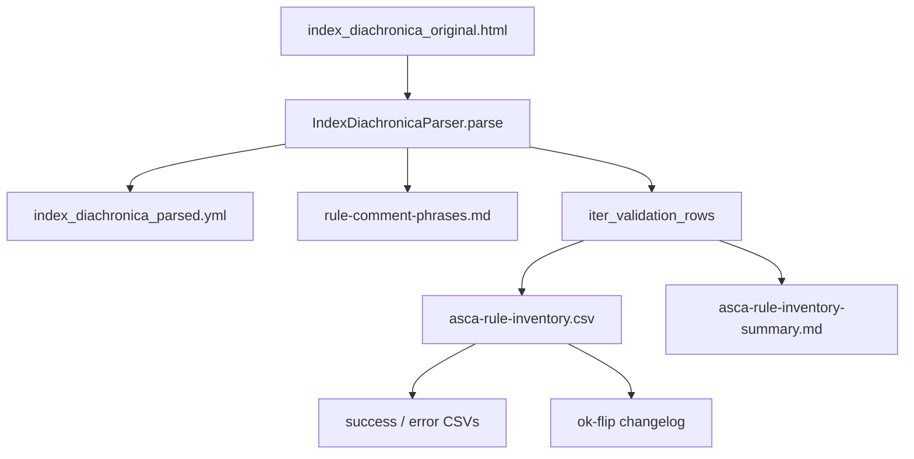

# Applier-neutral corpus validation

Stage 2 of the sound-change rule pipeline: after [Index Diachronica parse](./index-diachronica-parser.md), before the corpus meets adoption criteria.

This stage is the **correction loop** — it exercises [applier compile](./sound-change-applier.md) and [compile validation](./sound-change-applier.md#compile-validation) per rule to measure whether the **applier-neutral corpus** ([ADR-0002](./adr/0002-applier-neutral-yaml-rule-corpus.md)) produces valid ASCA, clusters failures for **class-first** correction, and iterates until adoption criteria are met. It is **not** ingest-time validation ([ADR-0003](./adr/0003-validate-after-applier-compile.md)): corpus fields may remain Index-shaped; the gate is post-compile `validate_asca`.

**Spec:** [.scratch/cleaned-rule-corpus/spec.md](../.scratch/cleaned-rule-corpus/spec.md)  
**Wayfinder map:** [.scratch/cleaned-rule-corpus/map.md](../.scratch/cleaned-rule-corpus/map.md)  
**Glossary:** [CONTEXT.md](../CONTEXT.md) — *Corpus rule*, *Failure class*, *Validation report*, *Rule status*, *Class-first*, *Historical fidelity*

---

## Steady-state workflow

The correction loop is driven by a single command:

```bash
uv run regenerate_corpus
```



**Default paths:**

| Output | Path |
| --- | --- |
| Cleaned YAML | `data/diachronica/index_diachronica_parsed.yml` |
| Inventory dir | `.scratch/cleaned-rule-corpus/inventory/` |
| Comment phrase survey | `.scratch/cleaned-rule-corpus/rule-comment-phrases.md` |
| Probe wordlist | `tests/fixtures/asca_probe_words.wsca` |

**Flags:** `--skip-validation` (ingest only), `--limit N` (smoke), `--html`, `--yaml-out`, `--inventory-dir`, `--probe-words`.

Ingest-only (no `asca` on PATH): `uv run regenerate_corpus --skip-validation`.

**Steady-state loop** ([ticket 05](../.scratch/cleaned-rule-corpus/issues/05-correction-workflow-invalid-rules.md)):

1. Parse HTML → compile → validate per rule
2. Regenerate YAML + validation report
3. Git-diff YAML for churn control
4. Grow fixtures for changed **rule status**
5. Cluster **failure classes** (pandas on CSV)
6. File/implement correction pass
7. Repeat

---

## Inventory

**Goal:** Record, per **corpus rule**, whether ASCA compile validation passes — with section identity and failure taxonomy for clustering.

| Step | What happens | Code / artifact |
| --- | --- | --- |
| 1 | Parse HTML → applier-neutral YAML | `IndexDiachronicaParser` → `data/diachronica/index_diachronica_parsed.yml` |
| 2 | For each corpus rule in each section | `iter_validation_rows()` in `corpus_inventory.py` |
| 3 | Build mini-section (one rule) | `_mini_section()` |
| 4 | Compile | `DiachronicSeries(mini, group_mappings=…)` |
| 5 | Validate | `validate_asca(..., probe_words=tests/fixtures/asca_probe_words.wsca)` |
| 6 | Classify failure | `classify_error()`, `reason_for_failure()`, `parse_unknown_token_error()` |
| 7 | Emit artifacts | See [Validation report](#validation-report) below |

**Scope:** One row per **corpus rule** (not whole-section-only). Held-out rules (`skip: true` on the corpus rule, rendered as ASCA comments) validate as ok with description `held-out (commented rule)`. Parse-time missing-`→` failures emit a `skipped` string on the rule dict but are **not** held-out — they inventory as `ok=False`.

**Baseline metrics** (re-run after each correction pass):

| Era | Rules | OK | Notes |
| --- | ---: | ---: | --- |
| Provisional AI YAML + asca 0.9.3 | 9721 | 57.1% | [Ticket 02](../.scratch/cleaned-rule-corpus/issues/02-inventory-valid-vs-invalid-rules.md) |
| Cleaned schema + passes 14–25 | 9317 | 68.9% | [Ticket 12](../.scratch/cleaned-rule-corpus/issues/12-full-corpus-validation-inventory.md) |
| Current on-disk summary | 9317 | **70.4%** (6561 ok) | [inventory summary](../.scratch/cleaned-rule-corpus/inventory/asca-rule-inventory-summary.md) |

**Top failure classes (current):** `syntax_other`, `unknown_character`, `expected_underscore`, `unknown_feature`.

**Limitations (accepted):** Tier 4 runtime failures may be under-detected when the fixed baseline wordlist does not match rule shape (~98% of failures are Tier 1–2 syntax). Rule-derived probe synthesis — [ticket 10](../.scratch/cleaned-rule-corpus/issues/10-rule-derived-probe-synthesis.md) — **wontfix**.

---

## Validation report

Temporary **analysis artifacts**, not long-term source of truth ([ADR-0010](./adr/0010-historical-fidelity-class-first-status.md)). Corpus YAML carries thin optional `status` only (`needs-validation` | `skipped`; omit = ok).

**Artifacts** (under `.scratch/cleaned-rule-corpus/inventory/`):

| File | Role | Ticket |
| --- | --- | --- |
| `asca-rule-inventory.csv` | Full per-rule report (rewritten each regen) | [12](../.scratch/cleaned-rule-corpus/issues/12-full-corpus-validation-inventory.md) |
| `asca-rule-inventory-success.csv` | Filtered `ok=True` | [34](../.scratch/cleaned-rule-corpus/issues/34-inventory-success-error-splits-and-ok-changelog.md) |
| `asca-rule-inventory-error.csv` | Filtered `ok=False` | [34](../.scratch/cleaned-rule-corpus/issues/34-inventory-success-error-splits-and-ok-changelog.md) |
| `asca-rule-inventory-changelog.csv` | Append-only **ok flips** matched by `(source, alt_idx)` (HTML `file:line` + optional-output alternative). Pass `--reset-changelog` to overwrite after a column-schema change. | [34](../.scratch/cleaned-rule-corpus/issues/34-inventory-success-error-splits-and-ok-changelog.md) |
| `asca-rule-inventory-summary.md` | Counts, percentages, top failure classes, common `error_token`s | [12](../.scratch/cleaned-rule-corpus/issues/12-full-corpus-validation-inventory.md) |
| `asca-field-isolation.csv` | per-field `blame`; default fails-only (`whole_ok == false`) | [36](../.scratch/cleaned-rule-corpus/issues/36-per-field-asca-blame-in-inventory.md) |
| `asca-field-isolation-success.csv` | filtered `whole_ok == true` | [36](../.scratch/cleaned-rule-corpus/issues/36-per-field-asca-blame-in-inventory.md) |
| `asca-field-isolation-error.csv` | filtered `whole_ok == false` | [36](../.scratch/cleaned-rule-corpus/issues/36-per-field-asca-blame-in-inventory.md) |

**CSV columns** (`VALIDATION_CSV_COLUMNS` in `corpus_inventory.py`):

`section_index`, `section_name`, `rule_id`, `alt_idx`, `source`, `ok`, `failure_class`, `reason`, `error_token`, `suggested`, `description`

`alt_idx` is the 0-based optional-output alternative index (e.g. `d → {∅,ð}` emits one row per alternative and never the parent's random pick); it is empty for rules without alternatives.

**Reason vocabulary** (filterable skip decisions): `trailing-comment`, `broken-syntax`, `asca-unrepresentable`, `valid-but-inaccurate`, `other`

**Failure classes** (regex-matched from ASCA stderr): include `syntax_other`, `unknown_character`, `unknown_feature`, `unknown_grouping`, `expected_underscore`, `nested_brackets`, `prose_or_expected_arrow`, `runtime_*`, `panic_other`, etc. — full list in `ERROR_CLASS_PATTERNS` (`corpus_inventory.py`).

**Changelog behaviour:** First run (no prior CSV) emits no flip rows; subsequent runs append only when `ok` changes for the same `source`, with shared UTC `timestamp` per run.

---

## Correction pass

**Goal:** Reduce failure clusters via **class-first** transforms — parser (parse-time) or compiler (`SoundChangeRule`, compile-time) — without meaning-changing rewrites unless owner-approved.

**Standing recipe** — [ticket 13](../.scratch/cleaned-rule-corpus/issues/13-correction-pass-template.md):

1. Name target **failure class** / `error_token` cluster from inventory summary or CSV.
2. Implement transform per **edit ladder** ([ticket 04](../.scratch/cleaned-rule-corpus/issues/04-historical-fidelity-vs-validity.md), [ADR-0010](./adr/0010-historical-fidelity-class-first-status.md)).
3. Re-run `uv run regenerate_corpus`.
4. Record before/after ok/fail and residual cluster size in ticket **Answer**.
5. Update fixtures when **rule status** or validation outcome changes intentionally.

**Where fixes live:**

| Layer | Module | Examples (tickets 14–25) |
| --- | --- | --- |
| Parse-time | `IndexDiachronicaParser` / `parsers.py` | em dash [16](../.scratch/cleaned-rule-corpus/issues/16-correction-pass-em-dash.md), arrow [17](../.scratch/cleaned-rule-corpus/issues/17-correction-pass-arrow.md), chain split [18](../.scratch/cleaned-rule-corpus/issues/18-correction-pass-chain-split.md), sporadic [19](../.scratch/cleaned-rule-corpus/issues/19-correction-pass-sporadic-qualifier.md), glosses [21](../.scratch/cleaned-rule-corpus/issues/21-correction-pass-trailing-glosses.md), stress [22](../.scratch/cleaned-rule-corpus/issues/22-correction-pass-stress-conditions.md), smart quotes [24](../.scratch/cleaned-rule-corpus/issues/24-correction-pass-smart-quotes.md) |
| Compile-time | `SoundChangeRule` in `rules.py` | class letters [14](../.scratch/cleaned-rule-corpus/issues/14-correction-pass-unknown-grouping.md), length marks [15](../.scratch/cleaned-rule-corpus/issues/15-correction-pass-length-marker.md), [25](../.scratch/cleaned-rule-corpus/issues/25-correction-pass-bare-length-marker.md), ejectives [20](../.scratch/cleaned-rule-corpus/issues/20-correction-pass-ejective-marks.md), labialized letters [23](../.scratch/cleaned-rule-corpus/issues/23-correction-pass-labialized-class-letters.md) |

**Policy highlights:**

- Prefer **historical fidelity** over valid-but-inaccurate rewrites → `status: skipped`, CSV reason `valid-but-inaccurate`.
- Structural normalisation → `status: needs-validation`; agent clears on clean re-validate.
- During bulk correction, do **not** pre-emptively skip unmapped tokens ([ticket 26](../.scratch/cleaned-rule-corpus/issues/26-parse-time-correspondence-series-indices.md)).
- Permanent skip / rare same-intent swaps → **project owner only**.

**Resolved correction passes (14–25):** unknown_grouping, length marker ː, em dash, arrow →, chain split, sporadic glosses, ejective ʼ, trailing glosses, stress env, labialized class letters, smart quotes, bare length marker.

**Follow-on cluster work:** correspondence-series [26–28](../.scratch/cleaned-rule-corpus/issues/26-parse-time-correspondence-series-indices.md), unknown_feature [32](../.scratch/cleaned-rule-corpus/issues/32-correction-pass-unknown-feature.md), positional/identity subscripts (planned compile-time, [spike 38](../.scratch/cleaned-rule-corpus/issues/38-spike-asca-compile-transform-order.md)). (`samePOA` and other deferred unknown_feature leftovers: inventory-driven; no dedicated ticket.)

---

## Key modules

| Path | Role |
| --- | --- |
| [`regenerate_corpus.py`](../src/conlanger/scripts/regenerate_corpus.py) | Orchestration entry point |
| [`corpus_inventory.py`](../src/conlanger/tools/corpus_inventory.py) | Per-rule validation, CSV/changelog/summary |
| [`corpus_io.py`](../src/conlanger/tools/corpus_io.py) | Write cleaned YAML |
| [`parsers.py`](../src/conlanger/tools/parsers.py) | `IndexDiachronicaParser` |
| [`rules.py`](../src/conlanger/tools/rules.py) | Section compile (`DiachronicSeries`) |
| [`asca_validator.py`](../src/conlanger/tools/asca_validator.py) | `validate_asca` |

**Primary integration seam (tests):** `tests/conlanger/tools/test_corpus_pipeline.py` — HTML → parse → `DiachronicSeries` → `validate_asca`.

---

## ADR cross-links

| ADR | Relevance |
| --- | --- |
| [0002](./adr/0002-applier-neutral-yaml-rule-corpus.md) | Corpus is applier-neutral; validation report stays out of YAML |
| [0003](./adr/0003-validate-after-applier-compile.md) | Inventory runs post-compile, not at ingest |
| [0006](./adr/0006-html-source-of-truth-yaml-successor.md) | HTML source of truth until adoption criteria met |
| [0010](./adr/0010-historical-fidelity-class-first-status.md) | Class-first ladder; skip vs needs-validation |

---

## Pipeline placement

| Stage | Doc |
| --- | --- |
| Index Diachronica parse | [index-diachronica-parser.md](./index-diachronica-parser.md) |
| **Applier-neutral corpus validation** (this page) | — |
| Applier compile | [sound-change-applier.md](./sound-change-applier.md) |
| Compile validation | [sound-change-applier.md#compile-validation](./sound-change-applier.md#compile-validation) |

See also [SYSTEM.md](./SYSTEM.md#pipeline-stages-new).
