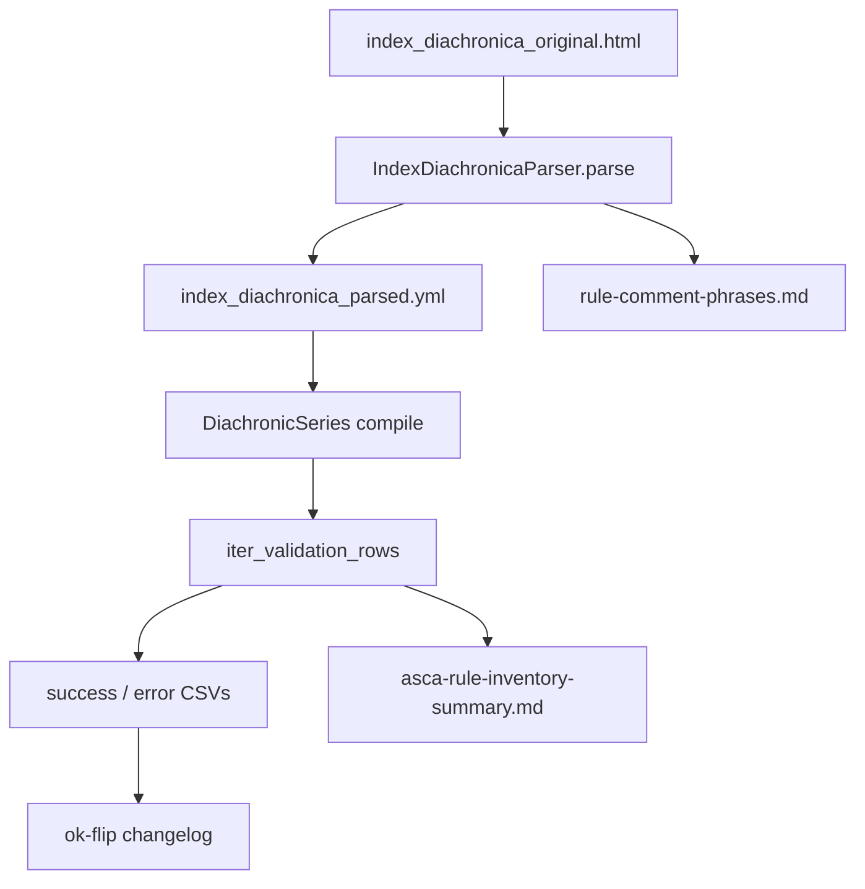

# Validate

Stage 3 of the sound-change rule pipeline: **parse → compile → validate** ([ADR-0013](./adr/0013-parse-compile-validate.md)).

After [Index Diachronica parse](./index-diachronica-parser.md) and [applier compile](./sound-change-applier.md), validate runs the applier checker and records inventory. This stage is the **correction loop** — it exercises compile + **compile validation** per rule to measure whether the **applier-neutral index** ([ADR-0002](./adr/0002-applier-neutral-yaml-rule-index.md)) produces valid ASCA, clusters failures for **class-first** correction, and iterates until adoption criteria are met. It is **not** ingest-time validation ([ADR-0003](./adr/0003-validate-after-applier-compile.md)): index fields may remain Index-shaped; the gate is post-compile `validate_asca`.

**Spec:** [.scratch/cleaned-rule-index/spec.md](../.scratch/cleaned-rule-index/spec.md)  
**Wayfinder map:** [.scratch/cleaned-rule-index/map.md](../.scratch/cleaned-rule-index/map.md)  
**Glossary:** [CONTEXT.md](../CONTEXT.md) — *Corpus rule*, *Failure class*, *Validation report*, *Rule status*, *Class-first*, *Historical fidelity*

---

## Steady-state workflow

The correction loop is driven by two commands:

```bash
uv run create_index && uv run validate_rules
```

- **Parse-only** (YAML + parse diagnostics): `uv run create_index`
- **Compile + validate** (inventory from existing YAML): `uv run validate_rules`



**Default paths:**

| Output | Path |
| --- | --- |
| Cleaned YAML | `data/diachronica/index_diachronica_parsed.yml` |
| Parse diagnostics | `.scratch/cleaned-rule-index/parse/` |
| Inventory dir | `.scratch/cleaned-rule-index/inventory/` |
| Comment phrase survey | `.scratch/cleaned-rule-index/parse/rule-comment-phrases.md` |
| Probe wordlist | `tests/fixtures/asca_probe_words.wsca` |

**`validate_rules` flags:** `--limit N` (smoke), `--yaml-in`, `--inventory-dir`, `--probe-words`, `--field-isolation`, `--use-asca-fork`, `--reset-changelog`.

**`create_index` flags:** `--html`, `--yaml-out`, `--parse-dir`.

**Steady-state loop** ([ticket 05](../.scratch/cleaned-rule-index/issues/05-correction-workflow-invalid-rules.md)):

1. Parse HTML → write YAML (`uv run create_index`)
2. Compile → validate per rule (`uv run validate_rules`)
3. Regenerate YAML and/or validation report as needed
4. Git-diff YAML for churn control
5. Grow fixtures for changed **rule status**
6. Cluster **failure classes** (pandas on CSV)
7. File/implement correction pass
8. Repeat

---

## Inventory

**Goal:** Record, per **index rule**, whether ASCA compile validation passes — with section identity and failure taxonomy for clustering.

| Step | What happens | Code / artifact |
| --- | --- | --- |
| 1 | Parse HTML → applier-neutral YAML | `IndexDiachronicaParser` → `data/diachronica/index_diachronica_parsed.yml` |
| 2 | For each index rule in each section | `iter_inventory_with_field_isolation()` in `index_inventory.py` |
| 3 | Build mini-section (one rule) | `_mini_section()` |
| 4 | Compile | `DiachronicSeries(mini, compiler_config=…)` |
| 5 | Validate | `validate_asca(..., probe_words=tests/fixtures/asca_probe_words.wsca)` |
| 6 | Classify failure | `classify_error()`, `parse_unknown_token_error()` |
| 7 | Emit artifacts | See [Validation report](#validation-report) below |

**Scope:** One row per **index rule** (not whole-section-only). Config hold-outs (`status: skipped` from `skip_rules` / `skip_sections`, rendered as ASCA comments) validate as ok with description `held-out (commented rule)`. Missing-`→` and other unlisted parse failures inventory as `ok=False` through compile validation.

**Baseline metrics** (re-run after each correction pass):

| Era | Rules | OK | Notes |
| --- | ---: | ---: | --- |
| Provisional AI YAML + asca 0.9.3 | 9721 | 57.1% | [Ticket 02](../.scratch/cleaned-rule-index/issues/02-inventory-valid-vs-invalid-rules.md) |
| Cleaned schema + passes 14–25 | 9317 | 68.9% | [Ticket 12](../.scratch/cleaned-rule-index/issues/12-full-index-validation-inventory.md) |
| Current on-disk summary | 9841 | **85.4%** (8400 ok) | [inventory summary](../.scratch/cleaned-rule-index/inventory/asca-rule-inventory-summary.md) |

**Section outcomes (current):** 417 / 714 sections all OK (58.4%); 268 some OK; 4 none OK; 25 sections skipped. See **Sections** in the summary markdown.

**Top failure classes (current):** `syntax_other`, `unknown_character`, `runtime_other`, `expected_underscore`.

**Limitations (accepted):** Tier 4 runtime failures may be under-detected when the fixed baseline wordlist does not match rule shape (~98% of failures are Tier 1–2 syntax). Rule-derived probe synthesis — [ticket 10](../.scratch/cleaned-rule-index/issues/10-rule-derived-probe-synthesis.md) — **wontfix**.

---

## Validation report

Temporary **analysis artifacts**, not long-term source of truth ([ADR-0010](./adr/0010-historical-fidelity-class-first-status.md)). Corpus YAML carries thin optional `status` only (`needs-validation` | `skipped`; omit = ok).

**Artifacts** (under `.scratch/cleaned-rule-index/inventory/`):

| File | Role | Ticket |
| --- | --- | --- |
| `asca-rule-inventory-success.csv` | Filtered `ok=True` | [34](../.scratch/cleaned-rule-index/issues/34-inventory-success-error-splits-and-ok-changelog.md) |
| `asca-rule-inventory-error.csv` | Filtered `ok=False` | [34](../.scratch/cleaned-rule-index/issues/34-inventory-success-error-splits-and-ok-changelog.md) |
| `asca-rule-inventory-changelog.csv` | Append-only **ok flips** matched by `(source, alt_idx)` (HTML `file:line` + optional-output alternative). Prior `ok` is read from the success/error split CSVs. Pass `--reset-changelog` to overwrite after a column-schema change. | [34](../.scratch/cleaned-rule-index/issues/34-inventory-success-error-splits-and-ok-changelog.md) |
| `asca-rule-inventory-summary.md` | Rule/section counts, failure-class table, **Common Errors** (top `error_token` and description clusters per failure class), field-isolation blame | [12](../.scratch/cleaned-rule-index/issues/12-full-index-validation-inventory.md) |
| `asca-field-isolation-success.csv` | filtered `whole_ok == true` (and per-field clean) | [36](../.scratch/cleaned-rule-index/issues/36-per-field-asca-blame-in-inventory.md) |
| `asca-field-isolation-error.csv` | filtered `whole_ok == false` or per-field fail | [36](../.scratch/cleaned-rule-index/issues/36-per-field-asca-blame-in-inventory.md) |
| `unknown_grouping_errors.csv` | `unknown_grouping` cluster rows | error-cluster tooling |
| `unknown_character_errors.csv` | `unknown_character` cluster rows | error-cluster tooling |
| `expected_underscore_errors.csv` | `expected_underscore` cluster rows | error-cluster tooling |
| `nested_brackets_errors.csv` | `nested_brackets` cluster rows | error-cluster tooling |
| `unknown_features_errors.csv` | `unknown_feature` cluster rows | error-cluster tooling |
| `syntax_other_errors.csv` | `syntax_other` cluster rows | error-cluster tooling |
| `runtime_other_errors.csv` | `runtime_other` cluster rows | error-cluster tooling |
| `expected_number_errors.csv` | `expected_number` cluster rows | error-cluster tooling |
| `prose_or_expected_arrow_errors.csv` | `prose_or_expected_arrow` cluster rows | error-cluster tooling |

**CSV columns** (`VALIDATION_CSV_COLUMNS` in `index_inventory.py`):

`section_index`, `section_name`, `rule_id`, `alt_idx`, `source`, `ok`, `failure_class`, `error_token`, `suggested`, `expected`, `description`

`alt_idx` is the 0-based optional-output alternative index (e.g. `d → {∅,ð}` emits one row per alternative and never the parent's random pick); it is empty for rules without alternatives.

**Summary markdown (`asca-rule-inventory-summary.md`):**

- **Rules** — ok / fail / skipped counts (section-skipped rules excluded from ok/fail percentages).
- **Sections** — mutually exclusive buckets: all OK, some OK, none OK, sections skipped (correction-pass prioritisation metric).
- **Failure classes** — full-class counts from error rows.
- **Common Errors** — for each failure class with a cluster CSV, top `error_token` rows plus (when token-less messages dominate) top normalised `description` rows; headings use `{failure_class} (error_token)` and `{failure_class} (description)`.
- **Field isolation blame** — when `--field-isolation` is on, per-field blame counts on whole-rule failure rows.

Inventory row count can exceed index rule count when optional-output alternatives emit multiple validated rows (`alt_idx`).

**Failure classes** (regex-matched from ASCA stderr): include `syntax_other`, `runtime_other`, `unknown_character`, `unknown_reference`, `expected_ipa`, `expected_range_dots`, `invalid_ipa`, and others — full ordered list in `ERROR_CLASS_PATTERNS` (`index_inventory.py`). Dedicated cluster CSVs exist for each class in `CLUSTER_CSV_BY_FAILURE_CLASS`.

**Changelog behaviour:** First run (no prior success/error split CSVs) emits no flip rows; subsequent runs append only when `ok` changes for the same `source`, with shared UTC `timestamp` per run. The prior inventory is reconstructed by concatenating the success and error split CSVs from the last regen.

---

## Compile validation

Compile validation is part of **validate** (not a separate pipeline stage). It runs **after** applier compile, not at HTML→YAML ingest ([ADR-0003](./adr/0003-validate-after-applier-compile.md)).

### `validate_asca`

Module: [`appliers/asca.py`](../src/conlanger/appliers/asca.py)

```python
validate_asca(
    rule: DiachronicSeries,
    *,
    probe_words: Path | None = None,
    timeout: float = 15.0,
) -> bool  # raises ASCAValidationError

validate_asca_syntax(rule: str, *, timeout: float = 15.0) -> bool
validate_asca_part(part: ASCARulePart, fragment: str, *, timeout: float = 15.0) -> bool
resolve_asca_bin() -> str | None  # ASCA_BIN env, then PATH
```

**Binary resolution:** `ASCA_BIN` if set, else `shutil.which("asca")`. Same helper for `validate_asca`, `run_asca`, and the field helpers. Install the fork with `validate` per [DEV.md](./DEV.md#asca-sound-change-rule-validation).

**Flow:**

1. `_active_rule_changes(rule)` — collect `SoundChangeRule` parts whose rendered line does **not** start with `#` (skipped rules render as `#\t…`).
2. Error if no active rules.
3. Resolve asca binary (`ASCA_BIN` or `PATH`; expects **0.10.x**, fork **0.10.3+** for `validate`).
4. Write `str(rule)` (+ trailing newline) to temp `check.rsca`.
5. Resolve probe wordlist (see below).
6. When the binary supports `validate`: `subprocess.run([asca, "validate", "-r", rsca_path], …)` — fast syntax/structure fail (Tiers 1–3).
7. `subprocess.run([asca, "run", words_path, "--rules", rsca_path], …)` — still required for inventory `ok` (Tier 4).
8. Non-zero exit → `ASCAValidationError` with cleaned stderr.
9. Also fail if stderr contains `Syntax Error` or `Runtime Error` even on exit 0.

**Field helpers** (fork `validate` only; for later field isolation — inventory does **not** use these for `ok`):

- `validate_asca_syntax("a > b / _")` → `asca validate -s …`
- `validate_asca_part("env", "#_")` → `asca validate -s … -f context` (`env` maps to ASCA `context`)

**Inventory integration** (`index_inventory.py`): each index rule → `_mini_section` → `DiachronicSeries(mini, group_mappings=…)` → `validate_asca(..., probe_words=fixture)`.

### Probe wordlist

| Source | Path / content |
| --- | --- |
| Default (validator internal) | `a`, `ba`, `kata`, `sami`, `ntu` (5 words) |
| Inventory / tests fixture | `tests/fixtures/asca_probe_words.wsca` (same 5 words) |
| Override | `probe_words=` argument or `ASCA_PROBE_WORDS` env var |

**Purpose:** `asca run` exercises parse **and** apply (Tier 1–4 in validity research). Not parse-only.

**Limits** ([ticket 10](../.scratch/cleaned-rule-index/issues/10-rule-derived-probe-synthesis.md) wontfix):

- ~98% of inventory failures are Tier 1–2 syntax — baseline probes suffice for clustering.
- Tier 4 runtime errors (lonely sets, insertion+env, deletion-only-segment) may be **under-detected** when probes don't match rule shape — acceptable for correction-loop clustering.

### ASCA validation tiers

See [asca-rule-validity.md](../.scratch/cleaned-rule-index/research/asca-rule-validity.md) §5 for ASCA constraint detail:

| Tier | Stage | Caught by `validate_asca`? |
| --- | --- | --- |
| 1 | Lexer | Yes (`validate` when available, else `run`) |
| 2 | Parser | Yes |
| 3 | `split_into_subrules` (first apply) | Yes (`validate` when available, else `run`) |
| 4 | Runtime apply | Yes via `run` — probe-dependent |

### Skipped rules

Corpus `status: skipped` → `#\t{raw}` in ASCA output. `_active_rule_changes` excludes them; inventory marks `ok=True`, description `"held-out (commented rule)"`. Hold-out policy: `status: skipped` only from `skip_sections` / `skip_rules` in `parser_config.yml` — not boolean `skip: true` / `skipped: true`, and not parse-time auto-skip ([ADR-0010](./adr/0010-historical-fidelity-class-first-status.md), [ticket 89](../.scratch/cleaned-rule-index/issues/89-unify-status-skipped.md)).

---

## Correction pass

**Goal:** Reduce failure clusters via **class-first** transforms — parser (parse-time) or compiler (`SoundChangeRule`, compile-time) — without meaning-changing rewrites unless owner-approved.

**Standing recipe** — [ticket 13](../.scratch/cleaned-rule-index/issues/13-correction-pass-template.md):

1. Name target **failure class** / `error_token` cluster from inventory summary or CSV.
2. Implement transform per **edit ladder** ([ticket 04](../.scratch/cleaned-rule-index/issues/04-historical-fidelity-vs-validity.md), [ADR-0010](./adr/0010-historical-fidelity-class-first-status.md)).
3. Re-run `uv run create_index && uv run validate_rules`.
4. Record before/after ok/fail and residual cluster size in ticket **Answer**.
5. Update fixtures when **rule status** or validation outcome changes intentionally.

**Where fixes live:**

| Layer | Module | Examples (tickets 14–25) |
| --- | --- | --- |
| Parse-time | `IndexDiachronicaParser` / `parsers.py` | em dash [16](../.scratch/cleaned-rule-index/issues/16-correction-pass-em-dash.md), arrow [17](../.scratch/cleaned-rule-index/issues/17-correction-pass-arrow.md), sporadic [19](../.scratch/cleaned-rule-index/issues/19-correction-pass-sporadic-qualifier.md), glosses [21](../.scratch/cleaned-rule-index/issues/21-correction-pass-trailing-glosses.md), stress [22](../.scratch/cleaned-rule-index/issues/22-correction-pass-stress-conditions.md), smart quotes [24](../.scratch/cleaned-rule-index/issues/24-correction-pass-smart-quotes.md) |
| Compile-time | `SoundChangeRule` in `rules.py` | class letters [14](../.scratch/cleaned-rule-index/issues/14-correction-pass-unknown-grouping.md), length marks [15](../.scratch/cleaned-rule-index/issues/15-correction-pass-length-marker.md), [25](../.scratch/cleaned-rule-index/issues/25-correction-pass-bare-length-marker.md), ejectives [20](../.scratch/cleaned-rule-index/issues/20-correction-pass-ejective-marks.md), labialized letters [23](../.scratch/cleaned-rule-index/issues/23-correction-pass-labialized-class-letters.md), chain expansion [compile-time chains](../src/conlanger/tools/compile/asca/chains.py) |

**Policy highlights:**

- Prefer **historical fidelity** over valid-but-inaccurate rewrites → `status: skipped` on the index rule.
- Structural normalisation → `status: needs-validation`; agent clears on clean re-validate.
- During bulk correction, do **not** pre-emptively skip unmapped tokens ([ticket 26](../.scratch/cleaned-rule-index/issues/26-parse-time-correspondence-series-indices.md)).
- Permanent skip / rare same-intent swaps → **project owner only**.

**Resolved correction passes (14–25):** unknown_grouping, length marker ː, em dash, arrow →, compile-time chain expansion, sporadic glosses, ejective ʼ, trailing glosses, stress env, labialized class letters, smart quotes, bare length marker.

**Follow-on cluster work:** correspondence-series [26–28](../.scratch/cleaned-rule-index/issues/26-parse-time-correspondence-series-indices.md), unknown_feature [32](../.scratch/cleaned-rule-index/issues/32-correction-pass-unknown-feature.md), positional/identity subscripts (planned compile-time, [spike 38](../.scratch/cleaned-rule-index/issues/38-spike-asca-compile-transform-order.md)). (`samePOA` and other deferred unknown_feature leftovers: inventory-driven; no dedicated ticket.)

---

## Key modules

| Path | Role |
| --- | --- |
| [`create_index.py`](../src/conlanger/scripts/create_index.py) | Parse HTML → YAML + parse diagnostics |
| [`validate_rules.py`](../src/conlanger/scripts/validate_rules.py) | Load YAML → compile in memory → inventory |
| [`validation_cli.py`](../src/conlanger/scripts/validation_cli.py) | Shared ASCA fork/PATH resolution and `--version` probe |
| [`index_inventory.py`](../src/conlanger/tools/index_inventory.py) | Per-rule validation, CSV/changelog/summary |
| [`index_io.py`](../src/conlanger/tools/index_io.py) | Read/write cleaned YAML |
| [`parsers.py`](../src/conlanger/tools/parsers.py) | `IndexDiachronicaParser` |
| [`rules.py`](../src/conlanger/tools/rules.py) | Section compile (`DiachronicSeries`) |
| [`asca_validator.py`](../src/conlanger/tools/asca_validator.py) | `validate_asca` |

**Primary integration seam (tests):** `tests/conlanger/tools/test_index_pipeline.py` — HTML → parse → `DiachronicSeries` → `validate_asca`.

---

## ADR cross-links

| ADR | Relevance |
| --- | --- |
| [0002](./adr/0002-applier-neutral-yaml-rule-index.md) | Corpus is applier-neutral; validation report stays out of YAML |
| [0003](./adr/0003-validate-after-applier-compile.md) | Inventory runs post-compile, not at ingest |
| [0006](./adr/0006-html-source-of-truth-yaml-successor.md) | HTML source of truth until adoption criteria met |
| [0010](./adr/0010-historical-fidelity-class-first-status.md) | Class-first ladder; skip vs needs-validation |
| [0013](./adr/0013-parse-compile-validate.md) | Three pipeline stages; inventory under validate |

---

## Pipeline placement

| Stage | Doc |
| --- | --- |
| Index Diachronica parse | [index-diachronica-parser.md](./index-diachronica-parser.md) |
| Applier compile | [sound-change-applier.md](./sound-change-applier.md) |
| **Validate** (this page) | — |

See also [SYSTEM.md](./SYSTEM.md#pipeline-stages-new).
